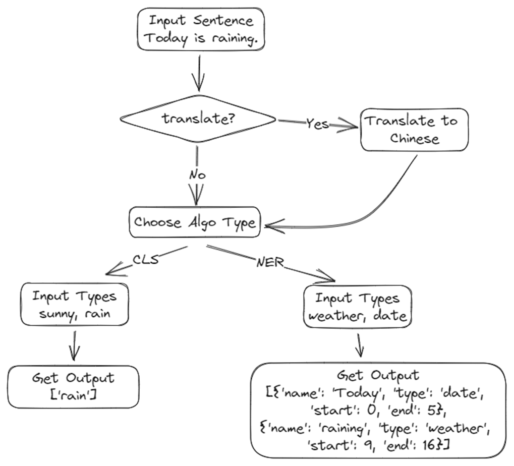
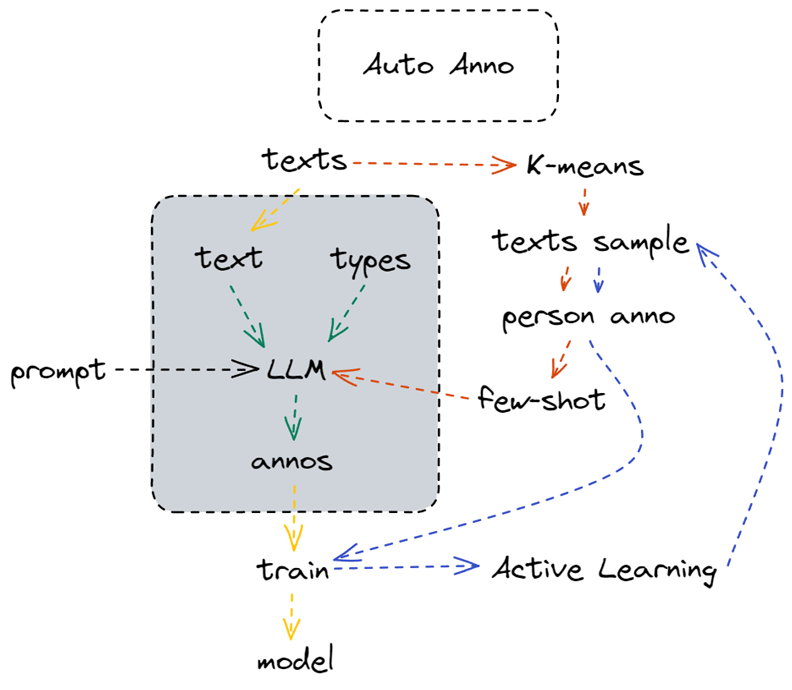
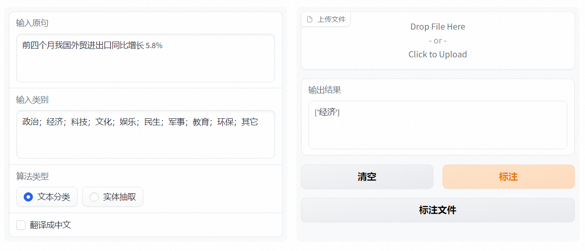
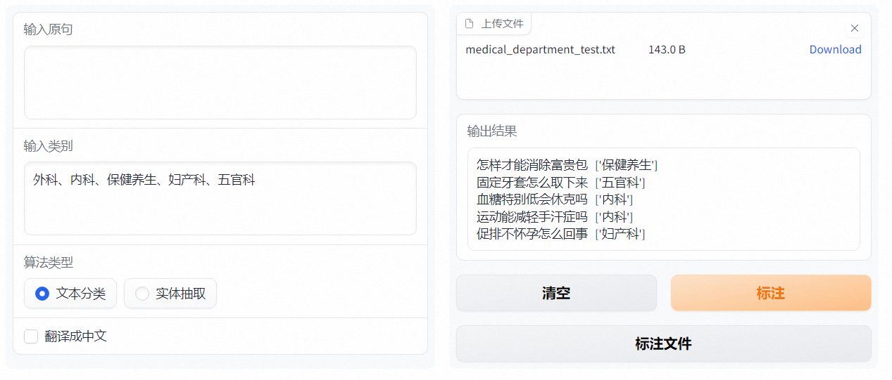
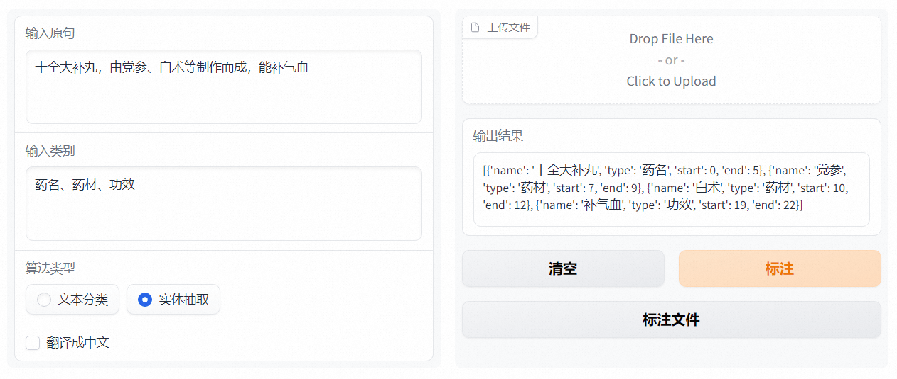

文件名：应用赛-LLMLab-auto_anno

## 一、作品登记表

| 团队名称 | 项目名称  | 项目简介       | 项目（应用）链接                                          |
| -------- | --------- | -------------- | --------------------------------------------------------- |
| LLMLab   | auto_anno | AI辅助自动标注 | https://aistudio.baidu.com/aistudio/projectdetail/6542456 |

## 二、团队信息

| 姓名   | AI Studio个人主页 | 学校/单位            | 专业/职位      | 团队角色 | 微信号        |
| ------ | ----------------- | -------------------- | -------------- | -------- | ------------- |
| 马琦钧 | 39911             | 杭州软通动力有限公司 | 高级研发工程师 | 队长     | maqijun123456 |

## 三、作品介绍

### 1. 产品背景

1.1. auto_anno可以自动标注，支持快速上线支持文本分类、实体抽取任务；

1.2. 未标注数据标注效率低，可以使用auto_anno来自动预标注，有了预标注后，能提升标注人员的效率；

1.3. 大模型输出不够格式化的问题，可以通过auto_anno文本分类的功能限定为数组输出；

1.4. 数据量巨大时，标注往往会无从下手，这时auto_anno支持先聚类，选聚类中心，用最少的标注获取最具泛化性的效果。

### 2. 产品说明

#### 2.1. 产品功能点

| 功能                                | 功能描述                                                        |
| ----------------------------------- | --------------------------------------------------------------- |
| 通过原文+分类选项，获取文本分类结果 | 支持意图识别、文本分类、科室引导等文本分类场景                  |
| 通过原文+实体选项，获取实体抽取结果 | 支持信息抽取、关键信息提取等实体抽取场景                        |
| 通过英文+翻译，获取中文数据集       | 用大模型兼容了翻译模型，扩充中文数据集                          |
| 文件批量标注                        | 通过txt格式的文本，一行为一条原文，上传点击标注文件后可批量标注 |

#### 2.2. 产品交互图

#### 2.3. 产品创新点

2.3.1. 通过大模型对数据进行预标注，减少标注时间；

2.3.2. 通过规范化的后处理，让大模型的输出可以嵌入其他流程直接使用（比如识别用户意图后，直接按分类进行后续处理）；

2.3.3. 对数据进行预分类，能从大量数据根据向量，从而有征对性地优先人工检查标注各聚类中心的数据，提高标注效率、快速迭代。

### 3. 数据说明

#### 3.1. 数据来源

3.1.1. 目前支持ChatGLM、一言千帆、ChatGPT大模型

3.1.2. Prompt来自队员对于不同prompt在不同领域数据的尝试，选取效果比较好的

#### 3.2. 数据描述

无

#### 3.3. 数据处理

无

#### 3.4. 数据示例

无

### 4. 技术实现路径

#### 4.1. 简述

4.1.1. gradio展示界面

4.1.2. 文本分类、实体抽取、中英翻译借助大模型

4.1.3. 数据根据向量结果聚类，选各个中心点进行标注

#### 4.2. 技术路径

### 5. 项目运行效果

#### 5.1. 文本分类

#### 5.2. 实体抽取

## 四、产品价值

### 1. 社会价值

减少基础标注，让数据标注聚焦到更有标注价值的数据上，脚本中有聚类获取优先待标注原文的功能

### 2. 用户价值

数据标签前让大模型先标注一遍，降低标注成本

### 3. 商业价值

3.1. 降本，有预标注的数据标注价格比没有预标注的标注价格便宜；

3.2. 增效，标注更快，开发周期缩短；

3.3. 规范化，让大模型可以直接对接后续规范化的流程。

## 五、项目总结

1. 通过大模型对传统标注进行赋能，让标注工作效率更高；
2. 也可以直接使用，完成一些指令选择（文本分类）、信息抽取（实体识别）等传统NLP模型的工作；

## 六、待解决问题或更多探索

1. 大模型在部分数据上效果还有待优化，可以探索更多的prompt；
2. 可针对不同领域继续微调大模型来提升大模型的泛化性；
3. 文本分类下AI有小概率回复所有已知选项，导致结果包含所有选项。后续可考虑用原文+答案的方式二次确认；
4. 通过已有标注数据，根据向量召回来对新原文做few-shot，脚本已测试能提升效果，待加入到网页中；
